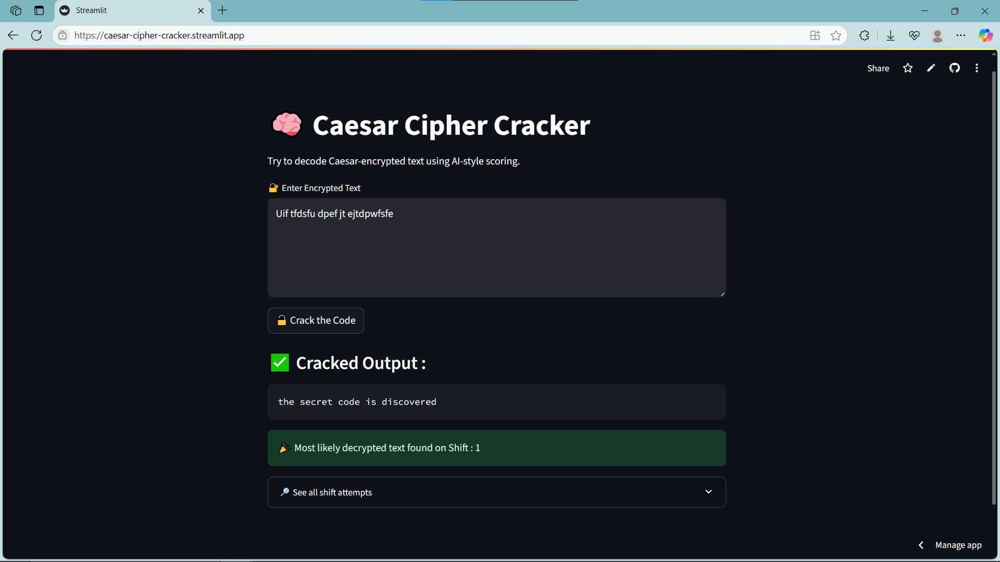

# 🔓 Caesar Cipher Cracker App

This app uses a Caesar cipher decryption algorithm combined with basic AI-style word scoring to intelligently guess the original plaintext from an encrypted message.

🧠 **No decryption key needed!** Just paste your encoded text, and the app will try all possible Caesar shifts, then highlight the most likely English sentence.

---

## 📷 Screenshot



---

## 🚀 Try the App

🔗 **[Click to open the app on Streamlit](https://caesar-cipher-cracker.streamlit.app/)**

---

## 💡 Features

- Try all 25 Caesar shift variations
- Score and rank decrypted outputs based on real English word matches
- Highlight the most likely decrypted message
- See all attempts in a clean, readable format

---

## 📁 How to Run Locally

1. Clone this repo  
   ```bash
   git clone https://github.com/ravi18kumar2021/caesar-cipher-cracker.git
   cd caesar-cipher-cracker

2. Install required Python packages
   ```bash
   pip install -r requirements.txt

3. Run the Streamlit app
   ```bash
   streamlit run app.py

---

## 📦 Requirements

This app uses:
* streamlit
* nltk

All dependencies are listed in the `requirements.txt` file.

---

## ✨ Built With

* [Python](https://www.python.org/)
* [Streamlit](https://streamlit.io/)
* [NLTK](https://www.nltk.org/) for word scoring.

---

## 🧠 Inspired by

Alan Turing’s pioneering work in cryptography and computing. 🗓️ **Created to honor his birthday (June 23)**.